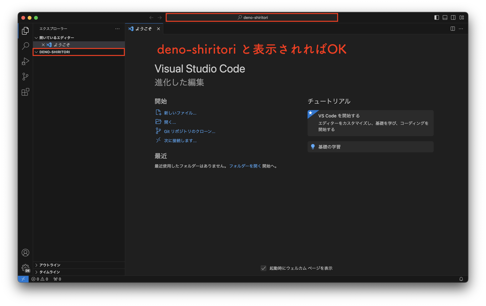
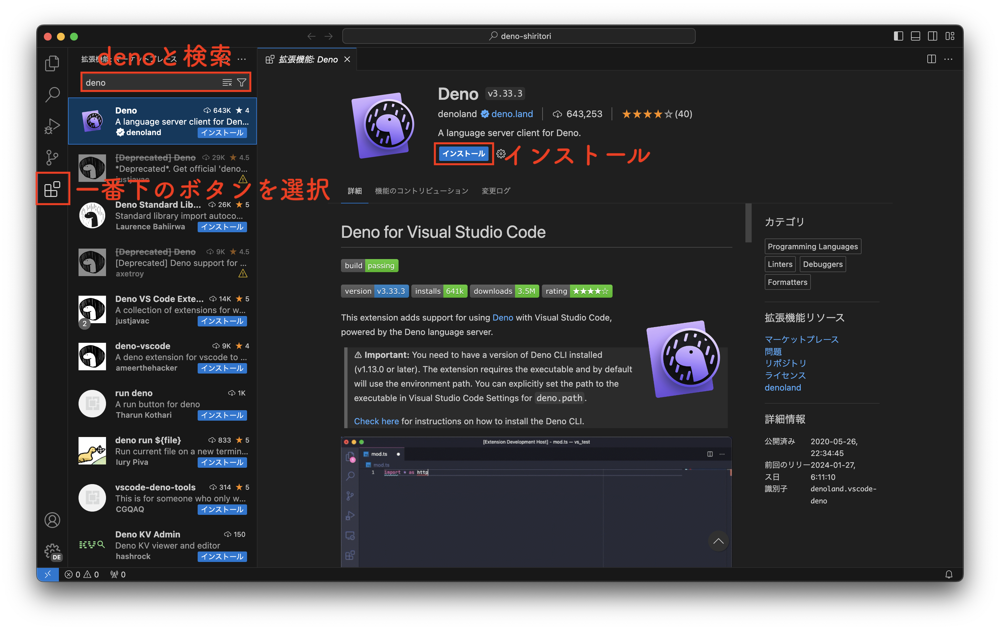
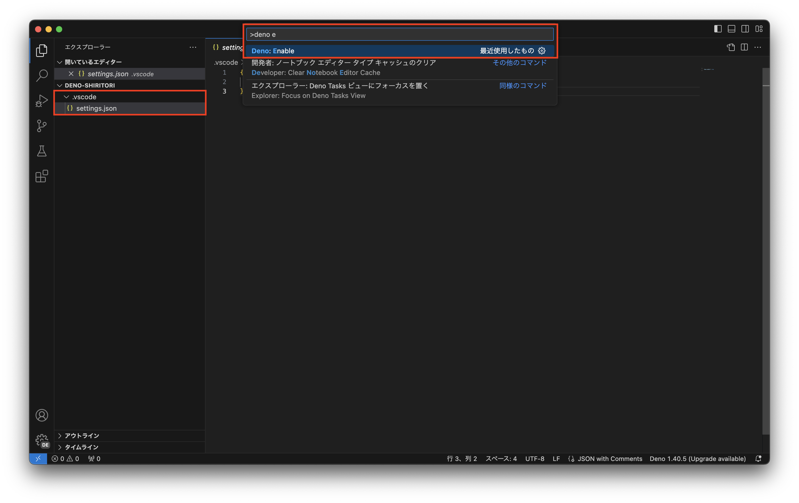
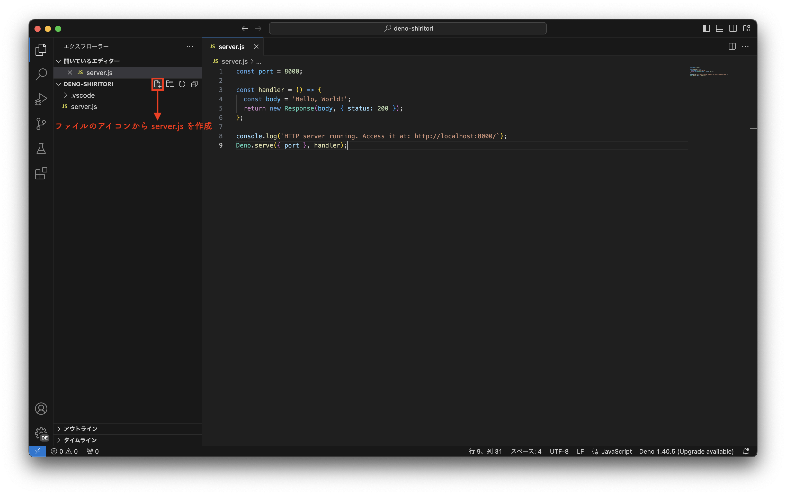
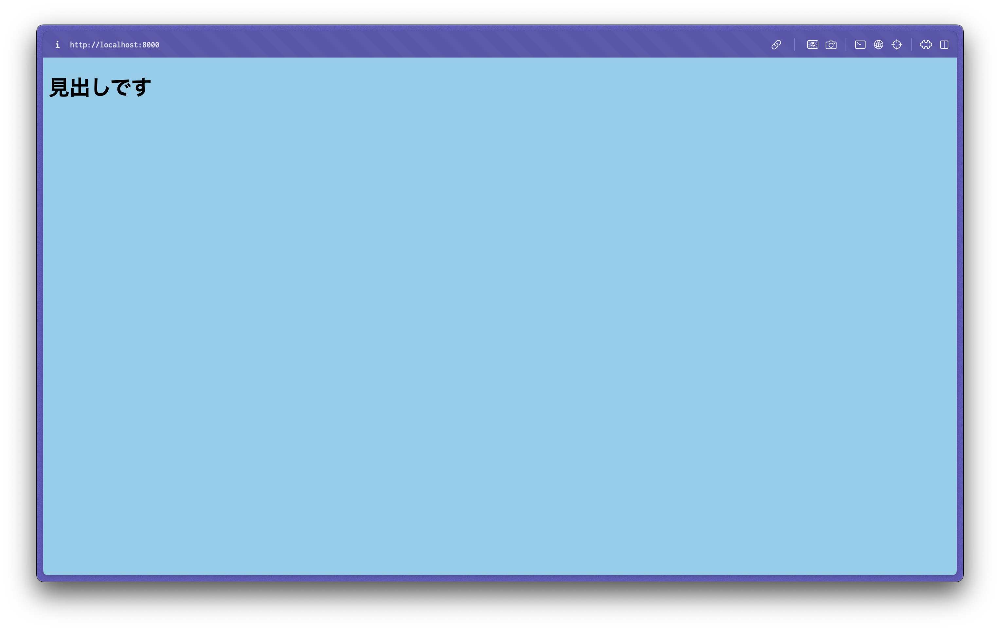

## 1. はじめに

今回はブラウザ上で動作するしりとりアプリを作成します。  
フロントエンドは HTML / CSS / JavaScript、バックエンドは JavaScript を使って作成します。

## 2. Deno について

Deno は JavaScript、TypeScriptの実行環境です。  
今回は、Deno を使用してサーバーを立てます。

フロントエンドで使用されることが多い JavaScript を使用してサーバーの実装もできるのが便利です。  
JavaScript を使用するサーバーというと Node.js が有名ですが、この Node.js 開発者が反省点をふまえて開発したのが Deno です。

## 3. 開発準備

しりとりアプリを作っていくにあたっての下準備を行います。

### ■ Deno のインストール

公式サイトを参考に Deno をインストールします。  
Install Deno のセクションに書かれている通り、コマンドを実行するだけでOKです。  
https://docs.deno.com/runtime/manual

インストールができたら以下のコマンドを実行してみましょう。  
Welcome to Deno! と表示されるのを確認してください。  

```bash
deno run https://deno.land/std/examples/welcome.ts
```

### ■ Visual Studio Code のインストール

プログラムを書くエディタとして、今回は Visual Studio Code (以下、VSCodeと表記) を使用します。  
公式サイトから該当するOSのインストーラをダウンロードしてインストールしましょう。  
https://code.visualstudio.com/download

### ■ ベースフォルダの作成

今回のプログラムを保存するフォルダを作成します。  
`deno-shiritori` という名前のフォルダを作成してください。

### ■ VSCode で開く

VSCode を起動して、Ctrl + O (Mac の場合は Cmd + O) を押し、先ほど作成した `deno-shiritori` フォルダを開きましょう。  
左側のエクスプローラーで「DENO-SHIRITORI (deno-shiritori) 」と表示されることを確認しましょう。



### ■ 拡張機能のインストール

続いて、Deno 関連のコードの補完のために拡張機能を入れていきます。
画面左上側のボタン群の1番下のボタンを押して「deno」と検索し、インストールしましょう。



インストールが終わったらコマンドパレット( Ctrl(Cmd) + Shift + P )を開き、「Deno: Enable」を実行します。  
左側のエクスプローラーで、`.vscode/settings.json` が生成されればOKです。



## 4. HTTP サーバーで Hello, World!

しりとりアプリの前に、Hello, World! と表示させるだけのシンプルなHTTPサーバーを立ち上げます。

### ■ HTTPサーバー

HTTPサーバーとは、HTTP ( Hypertext Transfer Protocol ) というプロトコルでブラウザと通信を行うサーバーです。  
現在はこのHTTP通信を暗号化した HTTPS ( Hypertext Transfer Protocol Secure ) 呼ばれるプロトコルが使われることが多いです。

### ■ Hello, World! までの手順

[公式ドキュメント](https://docs.deno.com/runtime/tutorials/http_server)のプログラムを参考に作っていきます。  
はじめにVSCode上で、`server.js` というファイルを作成し下記のコードを書いて保存します。  
(保存は Ctrl(Cmd) + S)



**server.js**

```js
const port = 8000;

const handler = () => {
  const body = 'Hello, World!';
  return new Response(body, { status: 200 });
};

console.log(`HTTP server running. Access it at: http://localhost:8000/`);
Deno.serve({ port }, handler);
```

続いて Ctrl(Cmd) + J でターミナルを開き、以下のコマンドからプログラムを実行します。

```bash
deno run --allow-net server.js
```

ターミナルに `Listening on http://localhost:8000/` と表示されたら、ブラウザで http://localhost:8000 にアクセスし、Hello, World! と表示されることを確認してください。

このプログラムは自動で終了しないので、ターミナルで Ctrl + C を押して終了させておきましょう。

### ★ Deno のパーミッションについて

Deno のプログラムではセキュリティの観点から、ファイル、ネットワーク、環境へのアクセスがデフォルトでは許可されません。  
公式ドキュメントでは「Deno is secure by default.」と書かれています。

これらを使用する場合は権限を許可する必要があり、上記の `--allow-net` はネットワークアクセスを許可します。  
その他にも `--allow-read` (ファイル読み取り)、`--allow-write` (ファイル書き込み)などがあります。

ちなみに `-A` と書くとすべての権限が許可されます。開発時はこちらを使用するのが便利です。

気になる方は公式ドキュメントの Permissions ページを読んでみてください。  
https://docs.deno.com/runtime/manual/basics/permissions

## 5. ファイルサーバー

ここからは、しりとりアプリを実装に入ります。  
ここでは、HTML や CSS ファイルを読み込んで表示できるようにします。

まず、`public` フォルダを作成し、その中に `index.html` ファイルを作成します。  
`index.html` には、以下のプログラムを書き込み保存してください。

**index.html**

```html
<!DOCTYPE html>
<html>

<head>
  <meta charset="utf-8">
</head>

<body>
  <h1>見出しです</h1>
</body>

</html>
```

このHTMLファイルを表示させるためには、`server.js` で下記のように変える必要があります。  
しかし、このように書く場合はCSSやJSファイル、別ページのHTMLファイルなど、ファイルを追加するたびにサーバーのコードを書き換えなければなりません。  

**server.js**

```js
const port = 8000;

const handler = async (_) => {
    return new Response(await Deno.readTextFile('./public/index.html'), {
        headers: { 'Content-Type': 'text/html; charset=utf-8' }
    })
};

console.log(`HTTP server running. Access it at: http://localhost:8000/`);
Deno.serve({ port }, handler);
```

これでは非効率的でめんどくさいので、 `public` フォルダの中のファイルを取得して返す、ファイルサーバーとして動作するようにします。  
`server.js` を下記のコードに置き換えてください。

**server.js**

```js
import { serveDir } from "https://deno.land/std@0.217.0/http/file_server.ts"

const port = 8000;

const handler = async (req) => {
    return serveDir(req, {
        fsRoot: 'public',
        urlRoot: '',
        showDirListing: true,
        enableCors: true,
    });
};

console.log(`HTTP server running. Access it at: http://localhost:8000/`);
Deno.serve({ port }, handler);
```

ここまで出来たら今回もターミナルからプログラムを実行します。    
先ほどとは少し違いますが、すべての権限を許可する `-A` と、プログラムに変更があった際に自動で更新してくれる `--watch` を指定しています。

```bash
deno run -A --watch server.js
```

これで `public` フォルダの中身が帰ってくるファイルサーバーを構築することができました。  
試しにCSSを追加してみましよう。`public` フォルダ内に `styles.css` を追加します。

**styles.css**

```css
body {
    background: skyblue;
}
```

`index.html` で `styles.css` を参照するようにします。

**index.html**

```html
<!DOCTYPE html>
<html>

<head>
  <meta charset="utf-8">
  <!-- 以下の link タグを追加してください -->
  <link rel="stylesheet" href="styles.css"> 
</head>

<body>
  <h1>見出しです</h1>
</body>

</html>

```

青い背景のページが表示されることを確認できればファイルサーバーの完成です。

